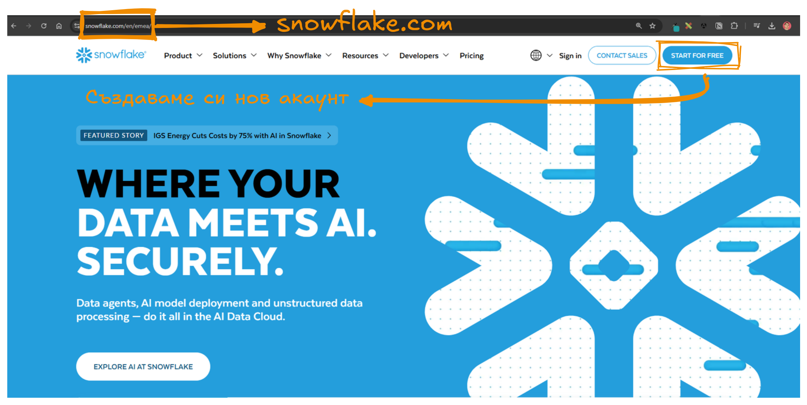

# Създаване на Snowflake акаунт

### Нека да си направим Snowflake account.

Първата и най-важна задача е да се регистрирама за Snowflake акаунт. Може би е очевидно, но облачната инфраструктура - е напълно менежирана и няма как, пък и няма нужда да си инсталираме системата локално.  Така че навигирайте до сайта на snowflake и нека започнем създаването на нов акаунт.

На този етап, всяка една нова регистрация в платформата на Snowflake автоматично и безплатно ни дава възможност да ползваме услугите, за 30 дена. Като допълнително имаме кредит от 400 дола, с които да си “плащаме” - за употребата на различни услуги. 

Въведете личните си данни и E-mail адрес за верификация, както и конкеткста в който се регистрирате. Двата най-популярни контекста за нашето обучение са:

- университетски  - уча в Snowflake курс;
- професионален - искам да се обуча по добре на Snowflake.

И двата контекста са напълно валидни за нашия сценарии.

Избора на контекст, ще ви предостави допълнителни въпроси за фирмата или учебната институция в която се обучавате в момента. Изберете името на фирмата или университета, както и набора от услуги или така наречения план, който ще ползваме. 

За целите на нашето обучение, всички планове са ни напълно еднакви - така че не губете време и усилия на този етап, защото разликите между опциите не са тема, която ще коментираме. 

По важното и цветно нещо, над което трябва да се замислим е избора на облачна инфраструктура. Snowflake работи върху и чрез инстанция на:

- Microsoft
- Amazon
- Google

В професионален контекст, този избор може да бъде продиктуван главно, от инфраструктурата на клиента или компанията в която се намирате, но в нашия случай - най-лесно е да изберете AWS и да продължите нататък. Подробностите зад този избор, ще станат ясни на по късен етап, като искам силно да подчертая, че нито един от тях не е грешен. 

От тук до края на регистрационната процедура, от Snowflake се интересуват от причината поради която искаме да си направим акаунт, както и основните езици за програмиране, които ще ползваме, по време на практиката си. Няма грешен избор просто бъдете честни или смело натиснете бутона **Skip и продължете към следващия екран.** 

След като видите зелената стрелка, търпеливо изчакайте съобщение в пощата си, за да верифицирате регистрацията си. Вече сме **почти** в играта.

След като верифицираме регистрацията си - е време да си направим реален потребител и парола. Ако имате опит с базите данни, този потребител технически е вашият административен потребител за вход в Snowflake инстанцията ви. След като направите административен потребител лесно можете да повторите процеса и за спомагателни такива. 

Въведете избраното име както и сложна парола, и продължете напред.

