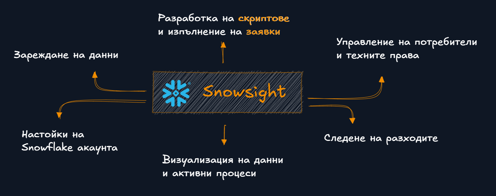

# Как можем да работим със Snowflake ?

Вече сме в играта, можем да започнем да творим или пък рушим, в зависимост от настроението, но голямата подчертавка която искам да направя преди да продължим напред е какви са всички начини, чрез които можем да ползваме платформата Snowflake. 

Представете си я като черна кутия, подавате и инструкции и тя връща някакъв резултат или изпълнява дадено действия. Вариантите за комуникация са няколко. 

Огромен процент от ежедневните ни операции ще са свързани с управление на процесите в платформата, работа с данни и следене на разходите. За тази цел ни се дават два интефейса:

- Web интерфейс (Snowsight) - който ни предоставя най-завършен набор от инструменти, с които да работим със ситемата.
- Конзолен интерфейс (SnowSQL) - през който можем да правим същото, но от комфорта на конзолата ни.

Ако обаче искаме за използваме SNowflake като платформа в комбинация, с друг програмен продукт, тогава ще ползваме така наречените Connector - и. Това са програмни интерфейси, с които можем да правим заявки, към платформата, с помоща на любимия ни език за програмиране.

